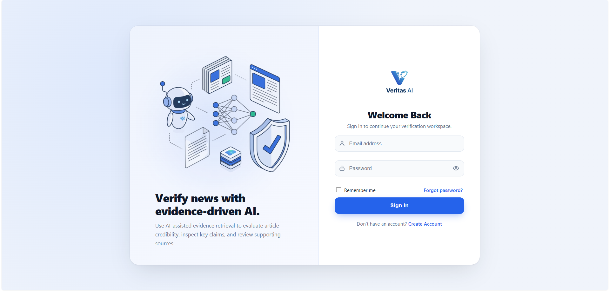
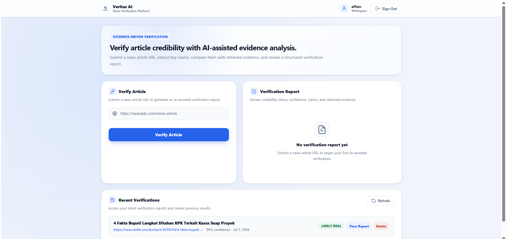
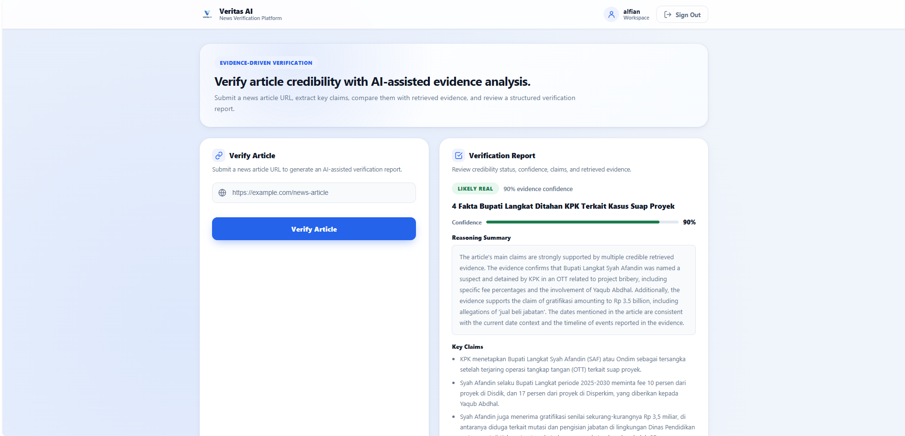
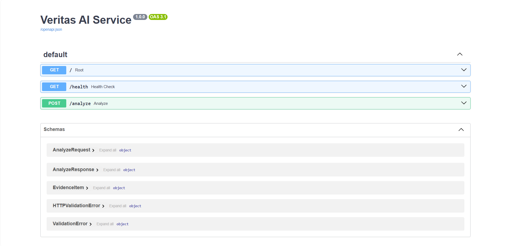

# Veritas AI

**Veritas AI** is an AI-assisted news verification platform that helps users evaluate article credibility through claim extraction, evidence retrieval, and LLM-based reasoning.

The system is designed as a verification assistant, not an absolute truth detector. It analyzes a submitted news URL, extracts key claims, retrieves related evidence from external sources, and generates a structured verification report containing a verdict, confidence score, reasoning summary, key claims, and supporting evidence.

---

## Live Demo

- **Web App:** https://veritasai.alwaysdata.net/public/login.html
- **AI Service API Docs:** https://alfian-id-veritas-ai-service.hf.space/docs
- **AI Service Health Check:** https://alfian-id-veritas-ai-service.hf.space/health

---

## Made With

<p align="left">
  
  
  
  
  
  
  
  
  
  
  
  
</p>

---

## Overview

Veritas AI provides a complete verification workflow for news articles:

1. The user submits a news article URL.
2. The PHP backend validates authentication and usage limits.
3. The AI service crawls the article content.
4. Key claims are extracted from the article.
5. Supporting or contradicting evidence is retrieved from external sources.
6. Gemini generates an evidence-aware verification report.
7. The result is stored in the user's verification history and displayed in the dashboard.

---

## Features

- User registration and login
- JWT-based authentication
- Password reset flow using email verification
- URL-based news article verification
- AI-assisted claim extraction
- Evidence retrieval from external news sources
- Verification verdict and confidence score
- Reasoning summary
- Key claims extraction
- Supporting evidence display
- Recent verification history
- Delete verification history
- Weekly usage limit per user
- Separate AI microservice deployment
- Public API documentation through FastAPI Swagger UI

---

## Screenshots

### Login Page

Secure authentication page for accessing the verification workspace.



---

### Dashboard Empty State

Users can submit a news article URL to generate an AI-assisted verification report.



---

### Verification Report

The dashboard displays the verdict, confidence score, reasoning summary, extracted claims, and evidence-based analysis.



---

### Evidence Sources

Retrieved evidence is displayed to improve transparency and help users review the basis of the verification result.


---

### AI Service API Documentation

The AI microservice is deployed separately using FastAPI and exposes interactive API documentation through Swagger UI.



---

## System Architecture

```text
User Browser
    |
    | HTML / CSS / JavaScript
    v
Alwaysdata Web App
    |
    | Native PHP Backend
    v
Supabase PostgreSQL
    |
    | Stores users, verification history, and usage logs


PHP Backend
    |
    | POST /analyze
    v
Hugging Face AI Service
    |
    | FastAPI + Python
    v
Crawler + Evidence Retrieval + Gemini API
    |
    v
Structured Verification Report
```

---

## Tech Stack

### Frontend

- HTML
- CSS
- JavaScript

### Backend

- Native PHP
- Composer
- JWT Authentication
- PHPMailer
- PostgreSQL
- Supabase

### AI Service

- Python
- FastAPI
- Gemini API
- Trafilatura
- Evidence retrieval pipeline

### Deployment

- Alwaysdata for PHP web application
- Hugging Face Spaces for AI microservice
- Supabase for PostgreSQL database

---

## API Endpoints

### PHP Backend

| Method | Endpoint                               | Description                    |
| ------ | -------------------------------------- | ------------------------------ |
| POST   | `/api/auth_user/register.php`          | Register a new user            |
| POST   | `/api/auth_user/login.php`             | Authenticate user              |
| GET    | `/api/auth_user/me.php`                | Get authenticated user profile |
| POST   | `/api/auth_user/forgot_password.php`   | Request password reset code    |
| POST   | `/api/auth_user/verify_reset_code.php` | Verify reset code              |
| POST   | `/api/auth_user/reset_password.php`    | Reset user password            |
| POST   | `/api/analysis/analyze.php`            | Analyze a news article URL     |
| GET    | `/api/analysis/history.php`            | Get user verification history  |
| DELETE | `/api/analysis/delete_history.php`     | Delete verification history    |

### AI Service

| Method | Endpoint   | Description                                              |
| ------ | ---------- | -------------------------------------------------------- |
| GET    | `/`        | Root status endpoint                                     |
| GET    | `/health`  | Health check endpoint                                    |
| POST   | `/analyze` | Analyze article content and generate verification report |

---

## Repository Structure

```text
veritas-ai/
├── api/
│   ├── analysis/
│   ├── auth_user/
│   └── middleware/
├── config/
├── helper/
├── public/
│   ├── assets/
│   ├── dashboard.html
│   ├── login.html
│   └── register.html
├── service_ai/
│   ├── app/
│   ├── tests/
│   ├── Dockerfile
│   ├── pyproject.toml
│   └── uv.lock
├── composer.json
├── composer.lock
└── README.md
```

---

## Environment Variables

The application requires environment variables for database connection, authentication, email delivery, and AI service integration.

```env
DB_HOST=
DB_PORT=
DB_NAME=
DB_USER=
DB_PASSWORD=

JWT_SECRET=
JWT_ISSUER=
JWT_AUDIENCE=
JWT_EXPIRE=

MAIL_HOST=
MAIL_PORT=
MAIL_USERNAME=
MAIL_PASSWORD=
MAIL_ENCRYPTION=
MAIL_FROM=
MAIL_FROM_NAME=

AI_SERVICE_URL=
AI_SERVICE_API_KEY=
```

Sensitive values such as database credentials, JWT secret, mail password, Gemini API key, and AI service API key should never be committed to the repository.

---

## Local Development

### PHP Web App

Install dependencies:

```bash
composer install
```

Run the PHP development server:

```bash
php -S 127.0.0.1:8000
```

Open the frontend:

```text
http://127.0.0.1:8000/public/login.html
```

---

### AI Service

Navigate to the AI service directory:

```bash
cd service_ai
```

Run the FastAPI service:

```bash
uv run uvicorn app.main:app --host 127.0.0.1 --port 5000 --reload
```

Open the API docs:

```text
http://127.0.0.1:5000/docs
```

---

## Deployment

Veritas AI is deployed using a multi-service architecture:

| Component                    | Platform            |
| ---------------------------- | ------------------- |
| Web frontend and PHP backend | Alwaysdata          |
| AI microservice              | Hugging Face Spaces |
| Database                     | Supabase PostgreSQL |

Production flow:

```text
Browser
→ Alwaysdata PHP Web App
→ Supabase PostgreSQL
→ Hugging Face FastAPI Service
→ Gemini API + Evidence Retrieval
→ Verification Report
```

---

## Limitations

- Some websites may block crawling or rely heavily on dynamic JavaScript rendering.
- Article extraction depends on the accessibility and structure of the target web page.
- Verification quality depends on the availability and relevance of retrieved evidence.
- The system is designed to assist verification, not to act as an absolute truth authority.
- Free-tier API and hosting limitations may affect response time and availability.

---

## Future Improvements

- Improve crawler fallback for JavaScript-heavy websites
- Add article text input as an alternative to URL-based verification
- Add caching for repeated URL analysis
- Improve evidence ranking and source reliability scoring
- Add clearer user-facing error messages for crawler failures and quota limits
- Add admin dashboard for monitoring usage and verification logs
- Add automated tests for backend and AI service endpoints

---

## Author

**Alfian**
